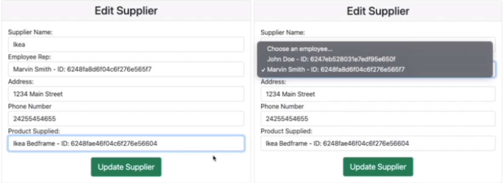

# Warehouse Management System 
## -CRUD MEAN Stack Web Application-
>built with Angular and Bootstrap on the frontend and Node and Express on the backend, with a MongoDB database

### Topic: Distribution Warehouse  
### Reason For Topic:
>Warehouses have many different aspects that can easily be formed into a series of related tables. The group was also previously familiar with warehouses and how they operate.

### Why we use these technologies:
> These technologies were used, because they were the requirements for the assignment.

### This project was created by:
> Created by - Lucas Magnusson, Genevieve Simpson and Akeem Palmer 

# How to run:
## Run Angular FrontEnd:
1. cd to mean-stack-assignment2 directory 
2. run npm install to download all dependencies
3. ng serve  - this starts the local server

## Run Node BackEnd:
1. cd to backend directory
2. run npm install - this downloads all the dependencies
3. touch config.env and add "PORT=4000" and "MONGO_URI=" connection for you MongoDB Database 
4. run "npm run dev" - this will start the application in a development environment.

>>
### Database Schema - Collections

>>
### CRUD - Eample 

>>
### Bonus - Dropdown and Carousel

>>
### Bonus - HTML Table Styling
