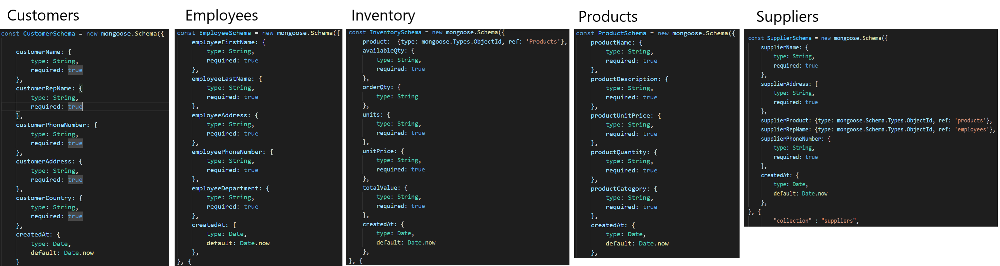
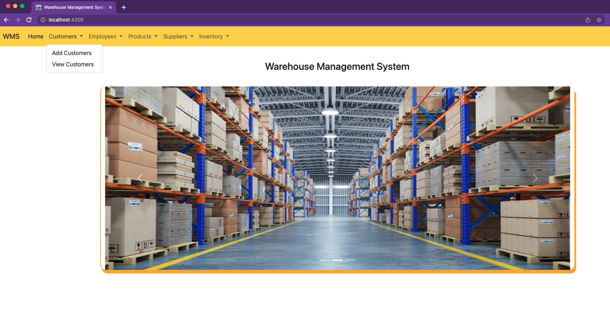
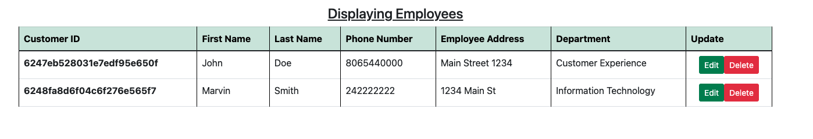

# Warehouse Management System

Topic: Distribution Warehouse  
Reason For Topic: Warehouses have many different aspects that can easily be formed into a series of related tables. The group was also previously familiar with warehouses and how they operate.
>>
### Database Schema - Collections

>>
### Bonus - Dropdown and Carousel

>>
### Bonus - HTML Table Styling
